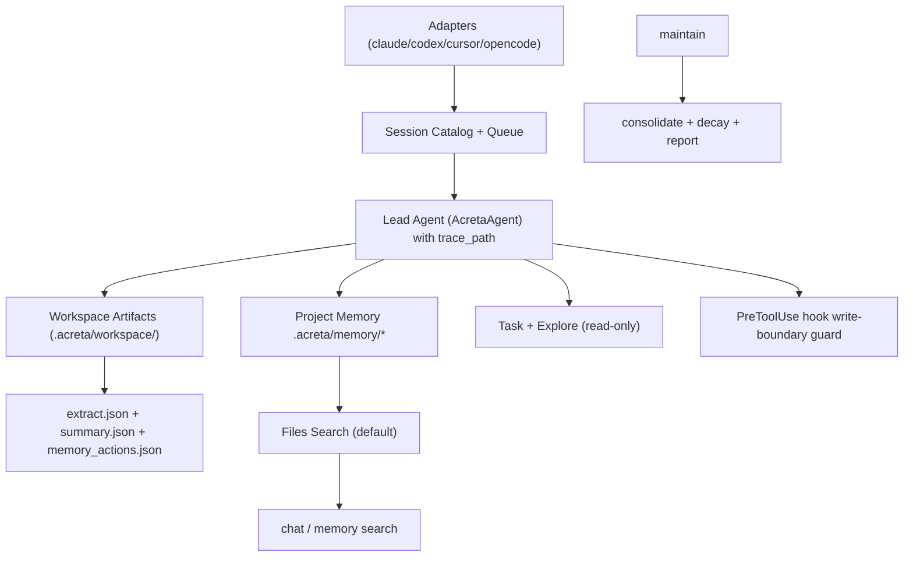

# Acreta Architecture (Memory V2)

Last updated: 2026-02-20

## Summary

Acreta is a file-first memory runtime for coding agents.

1. Ingest sessions from local agent adapters.
2. Lead runtime takes only `trace_path` and creates one per-run workspace folder.
3. Extraction and summarization run by trace-path CLI calls and write `extract.json` + `summary.json`.
4. Lead decides `add|update|no-op` by deterministic prompt policy and writes markdown files (`decision`, `learning`) plus one episodic `summary`.
5. Run evidence is stored as flat artifacts in the workspace folder.
6. Retrieve with project-first scope and global fallback.

## Runtime prerequisites

`dspy.RLM` runs through DSPy's Deno/Pyodide interpreter. Install Deno on host machines that run extraction.

```bash
brew install deno
deno --version
```

## System flow



## Storage model

Canonical memory files:

- `.acreta/memory/decisions/*.md`
- `.acreta/memory/learnings/*.md`
- `.acreta/memory/summaries/*.md`

Canonical sidecars:

- `.acreta/meta/state/<id>.json`
- `.acreta/meta/evidence/<id>.json`
- `.acreta/meta/traces/sessions/<agent>/<run_id>.jsonl`

Run workspace artifacts:

- `.acreta/workspace/<run_mode>-<YYYYMMDD-HHMMSS>-<shortid>/extract.json`
- `.acreta/workspace/<run_mode>-<YYYYMMDD-HHMMSS>-<shortid>/summary.json`
- `.acreta/workspace/<run_mode>-<YYYYMMDD-HHMMSS>-<shortid>/memory_actions.json`
- `.acreta/workspace/<run_mode>-<YYYYMMDD-HHMMSS>-<shortid>/agent.log`
- `.acreta/workspace/<run_mode>-<YYYYMMDD-HHMMSS>-<shortid>/subagents.log`
- `.acreta/workspace/<run_mode>-<YYYYMMDD-HHMMSS>-<shortid>/session.log`

Index folder:

- `.acreta/index/fts.sqlite3`
- `.acreta/index/graph.sqlite3`
- `.acreta/index/vectors.lance/`

## Scope resolution

Config precedence:

1. env vars
2. repo `.acreta/config.toml`
3. user `~/.acreta/config.toml`
4. repo `config.toml`

Memory scope modes:

- `project_fallback_global` (default)
- `project_only`
- `global_only`

## Related references

`related` values are explicit ids/slugs.

- No wikilink dependency in prompts or storage
- No required parser layer for `[[...]]` syntax

## Hot and cold paths

- `sync` hot path:
  - discover/index sessions
  - run lead by `trace_path`
  - write run artifacts to workspace folder
  - run lead decision (`add|update|no-op`)
  - write memory + summaries
- `maintain` cold path:
  - consolidate duplicates
  - decay lifecycle/confidence
  - write extract report

Query path (`chat`, `memory search`) is read-only.

Security boundary for memory-write flow:

- `permission_mode` is not `bypassPermissions`
- `PreToolUse` hook denies `Write|Edit` outside `memory_root` and current run folder
- subagent exploration stays read-only (`Explore` first; fallback `explore-reader` with `Read|Grep|Glob`)
