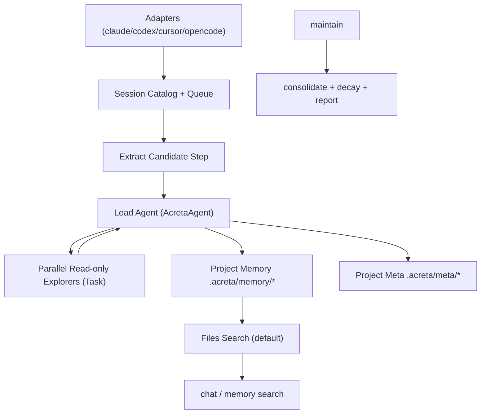

# Acreta Architecture (Memory V2)

Last updated: 2026-02-19

## Summary

Acreta is a file-first memory runtime for coding agents.

1. Ingest sessions from local agent adapters.
2. Extract primitive candidates from transcript archives via `dspy.RLM` (Ollama `qwen3:8b`).
3. Lead agent delegates retrieval to parallel read-only explorers (`Task`).
4. Lead decides `add|update|no-op` and writes markdown files.
5. Store operational metadata in sidecars.
6. Retrieve with project-first scope and global fallback.

## Runtime prerequisites

`dspy.RLM` runs through DSPy's Deno/Pyodide interpreter. Install Deno on host machines that run extraction.

```bash
brew install deno
deno --version
```

## System flow



## Storage model

Canonical memory files:

- `.acreta/memory/decisions/*.md`
- `.acreta/memory/learnings/*.md`
- `.acreta/memory/conventions/*.md`
- `.acreta/memory/context/*.md`

Canonical sidecars:

- `.acreta/meta/state/<id>.json`
- `.acreta/meta/evidence/<id>.json`
- `.acreta/meta/traces/sessions/<agent>/<run_id>.jsonl`

Index folder:

- `.acreta/index/fts.sqlite3`
- `.acreta/index/graph.sqlite3`
- `.acreta/index/vectors.lance/`

## Scope resolution

Config precedence:

1. env vars
2. repo `.acreta/config.toml`
3. user `~/.acreta/config.toml`
4. repo `config.toml`

Memory scope modes:

- `project_fallback_global` (default)
- `project_only`
- `global_only`

## Related references

`related` values are explicit ids/slugs.

- No wikilink dependency in prompts or storage
- No required parser layer for `[[...]]` syntax

## Hot and cold paths

- `sync` hot path:
  - discover/index sessions
  - extract primitives
  - run lead decision (`add|update|no-op`)
  - write memory + sidecars
- `maintain` cold path:
  - consolidate duplicates
  - decay lifecycle/confidence
  - write extract report

Query path (`chat`, `memory search`) is read-only.
