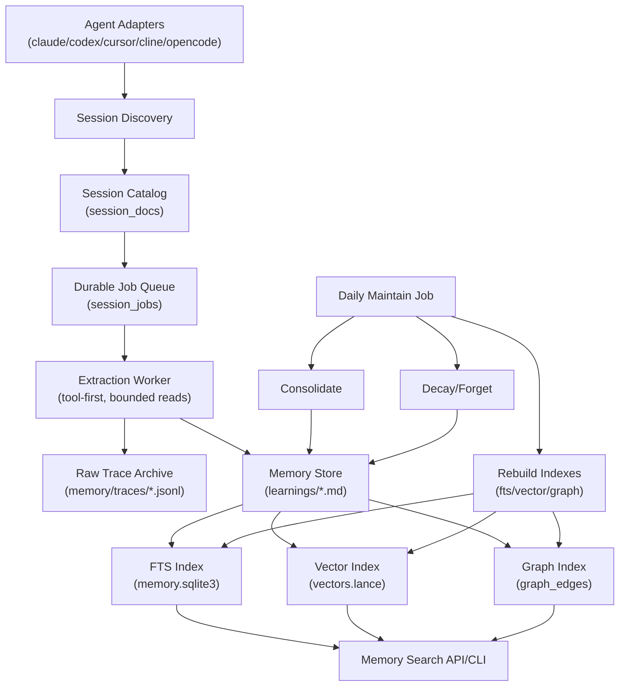
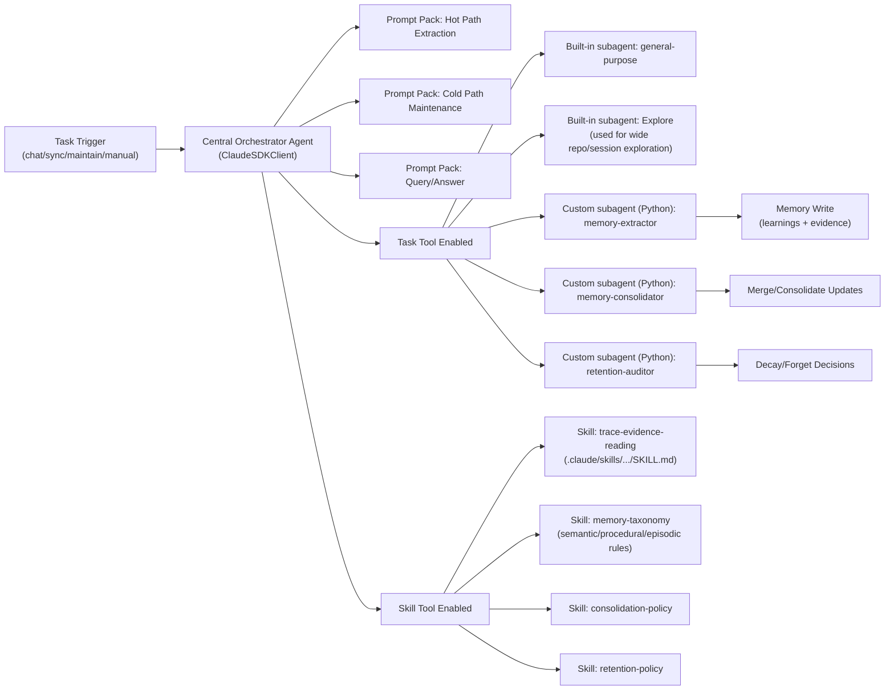
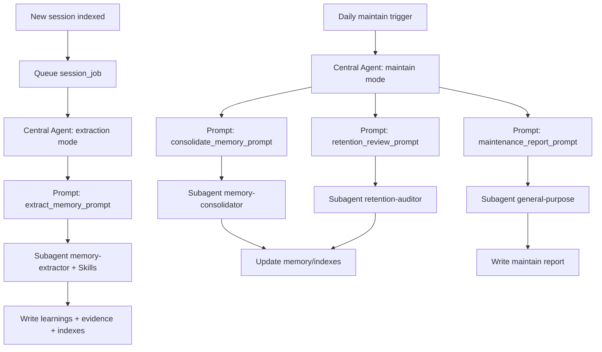

# Acretia Minimal Core Rebuild (Proposed)

## Summary

This is a clean-slate architecture for Acretia based on your intent, not on current folder names.

Main product scope only:
1. Connect coding-agent trace sources.
2. Detect new sessions.
3. Queue each session for processing.
4. Extract semantic/procedural/episodic memories with tool-first bounded reads.
5. Store raw traces + memory records.
6. Index for FTS + vector + graph.
7. Search memory.
8. Run daily maintenance (consolidate/forget/rebuild indexes).

Everything else is optional and should be removed from runtime surface.

## Current Folder Audit (acreta/)

This audit is from the full `acreta/` scan (file count + code lines) to decide what stays in core scope.

| Folder | Py Files | LOC | Current Role | Decision |
|---|---:|---:|---|---|
| `agents` | 22 | 2396 | Worker runtime + prompts + use-cases | Keep runtime pieces, remove analysis/readiness use-cases |
| `cli` | 4 | 2124 | CLI and command surface | Rewrite to minimal CLI |
| `connect` | 25 | 4832 | Adapters and session parsing | Keep; move under `adapters/` |
| `core` | 6 | 1262 | config/logging/utils | Keep but shrink heavily |
| `memory` | 11 | 1355 | learning store and maintenance | Keep as core |
| `models` | 2 | 304 | JSON validation/admin model | Remove with admin validate surface |
| `readiness` | 6 | 1766 | readiness scoring/reporting | Remove from runtime |
| `refine` | 4 | 1592 | extraction orchestration | Keep concept, rewrite as `extract/` |
| `search` | 20 | 3594 | retrieval/index/vector/graph | Keep core parts, split and simplify |
| `service` | 3 | 299 | locks + daemon trigger helper | Merge into app/runtime infra |
| `sessions` | 3 | 1725 | sessions DB + queue | Keep as core |
| `web` | 4 | 2579 | dashboard server/APIs | Remove from minimal core |

## System Architecture



## Dashboard After Refactor

You can still have a dashboard.  
The key is: keep it as a thin read-only surface, not a second product inside core runtime.

Recommended model:
- Keep core `acreta/` focused on ingestion, extraction, storage, indexing, and search.
- Build dashboard as a separate package/app (`apps/dashboard-lite`), reading only:
  - session catalog (`session_docs`)
  - job queue status (`session_jobs`)
  - memory index/search APIs
  - graph index (`graph_edges`) projection
- No dashboard-owned extraction logic.
- No dashboard-owned graph logic.
- No dashboard-triggered heavy write jobs by default.

What this gives you:
- You keep visibility.
- You avoid bloating core architecture again.
- You avoid drift between dashboard behavior and actual engine behavior.

## Agent + LLM Architecture (Central Agent)

Yes, this is possible and it fits your intent.

Design principle:
- One central orchestrator agent receives prompt + file paths + task context.
- It routes work to subagents only when needed.
- It uses Skills when reusable domain instructions are helpful.
- Extraction and cold-path use different prompt packs.



### Claude SDK facts applied here

From official docs:
- Subagents can be defined programmatically in SDK options (`agents={...}`) and invoked via `Task`.  
- Built-in `general-purpose` is available without defining it.  
- SDK docs show usage with an `Explore` subagent in examples; in practice we should treat `general-purpose` as guaranteed and `Explore` as available where supported by Claude runtime.  
- Skills are filesystem artifacts (`SKILL.md`) and loaded when `setting_sources`/`settingSources` include `project` or `user`, and `Skill` tool is enabled.  
- Tool access should be constrained with `allowed_tools` + permission mode + hooks.

### Central agent config pattern (Python)

Subagents are in Python (not markdown), as requested.

```python
from claude_agent_sdk import ClaudeAgentOptions, AgentDefinition

OPTIONS = ClaudeAgentOptions(
    allowed_tools=["Read", "Glob", "Grep", "Bash", "Task", "Skill"],
    permission_mode="default",
    setting_sources=["project", "user"],  # load Skills/CLAUDE.md if used
    agents={
        "memory-extractor": AgentDefinition(
            description="Extract semantic/procedural/episodic memories from a single session trace.",
            prompt="Use tool-first bounded evidence reads. Return strict JSON schema.",
            tools=["Read", "Glob", "Grep"],
            model="sonnet",
        ),
        "memory-consolidator": AgentDefinition(
            description="Merge duplicate/overlapping memories with provenance preservation.",
            prompt="Conservative merge policy. Never lose evidence links.",
            tools=["Read", "Glob", "Grep", "Edit", "Write"],
            model="sonnet",
        ),
        "retention-auditor": AgentDefinition(
            description="Review stale memories for decay/archive decisions under policy.",
            prompt="Apply retention policy strictly and explain each decision.",
            tools=["Read", "Glob", "Grep"],
            model="sonnet",
        ),
    },
)
```

## Prompt Plan (What prompts, where, and with which subagents/skills)

Use a small prompt set with clear ownership.

| Path | Prompt | Primary executor | Subagents | Skills |
|---|---|---|---|---|
| Hot path | `extract_memory_prompt` | central orchestrator | `memory-extractor`, optional `general-purpose` | `trace-evidence-reading`, `memory-taxonomy` |
| Hot path | `extract_summary_prompt` (episodic) | central orchestrator | `memory-extractor` | `memory-taxonomy` |
| Cold path | `consolidate_memory_prompt` | central orchestrator | `memory-consolidator`, optional `Explore` for broad duplicate search | `consolidation-policy` |
| Cold path | `retention_review_prompt` | central orchestrator | `retention-auditor` | `retention-policy` |
| Cold path | `maintenance_report_prompt` | central orchestrator | `general-purpose` | optional reporting skill |
| Query | `answer_from_memory_prompt` | central orchestrator | optional `general-purpose` for synthesis | optional style/domain skill |

Prompt design rules:
- Hot path prompts: strict, bounded, schema-driven, minimal context.
- Cold path prompts: batch/reasoning prompts with explicit policy constraints.
- Query prompt: read-only, citation/evidence focused, no write operations.

## Hot/Cold execution model with agent blocks



## Runtime Rules

- Query path is read-only. No writes/index sync during search.
- All writes happen in sync worker (hot path) or maintain lane (cold path).
- One canonical graph store only. Any visualization must read this same graph.
- One extraction engine path (AcretaAgent SDK).
- No readiness/analysis/eval in runtime commands.
- Central orchestrator is the only runtime agent entrypoint.
- Custom subagents are Python `AgentDefinition` objects (not markdown files).
- Skills remain markdown (`SKILL.md`) and are optional overlays, not core logic.

## Proposed Folder Structure (New)

```text
acreta/
  __init__.py
  __main__.py

  app/
    cli.py                 # only core commands
    daemon.py              # scheduler loop (sync + maintain)

  config/
    settings.py            # lean config model
    paths.py               # filesystem paths
    logging.py

  adapters/
    registry.py            # connected platforms registry
    base.py                # adapter interface
    claude.py
    codex.py
    cursor.py
    cline.py
    opencode.py

  sessions/
    catalog.py             # session_docs storage + listing
    queue.py               # session_jobs enqueue/claim/complete/fail
    archive.py             # raw trace archive writes/reads

  extract/
    orchestrator.py        # consume queue, run extraction
    prompts.py             # extraction prompts only
    parser.py              # strict JSON parse/validation
    metrics.py             # deterministic signals

  memory/
    models.py              # learning model + enums
    store.py               # markdown learning storage
    index.py               # SQLite FTS metadata + search
    vector.py              # embedding/vector upsert + query
    graph.py               # canonical graph edges + expansion
    maintenance.py         # consolidate + decay
    search.py              # hybrid retrieval orchestration

  runtime/
    agent.py               # SDK agent wrapper (`AcretaAgent`)
    guardrails.py
    providers.py
    subagents.py           # Python subagent specs (hot/cold/query lanes)
```

## Commands In Scope (Minimal)

Keep only:
- `acreta connect`
- `acreta sync`
- `acreta maintain`
- `acreta daemon`
- `acreta memory search|list|add|feedback|export`
- `acreta chat`
- `acreta status`
- `acreta dashboard` (thin read-only UI/API over canonical stores)

Remove from runtime:
- `readiness`
- broad `admin` surface (keep only a very small `admin db` if needed)
- all eval/runtime analysis commands

## Current -> New Copy/Move Map

### Keep and move with minor edits

- Adapters and parsing:
  - `acreta/connect/*` -> `acreta/adapters/*`
- Session indexing/discovery pieces:
  - `acreta/search/sessions/indexer.py` -> split into `sessions/catalog.py` + `extract/orchestrator.py` discovery helpers
- Durable queue logic:
  - `acreta/sessions/storage.py` (`session_jobs` functions) -> `sessions/queue.py`
- Session catalog storage and FTS session index:
  - `acreta/sessions/storage.py` (`session_docs` + FTS parts) -> `sessions/catalog.py`
- Trace archive:
  - `acreta/memory/store/trace_archive.py` + archive helpers in refine -> `sessions/archive.py`
- Extraction tasks/prompts:
  - `acreta/refine/agent_tasks.py` -> `extract/orchestrator.py` helpers
  - `acreta/agents/prompts/refine.py` (facet + learning prompts) -> `extract/prompts.py`
- Memory model/store:
  - `acreta/memory/store/models.py` -> `memory/models.py`
  - `acreta/memory/store/file_store.py` -> `memory/store.py`
- Memory index/search:
  - `acreta/search/memory/query/index.py` -> `memory/index.py` (trim to learning tables only)
  - `acreta/search/memory/search.py` + `acreta/search/ranking.py` -> `memory/search.py`
- Vector/graph:
  - `acreta/search/vector_store.py`, `acreta/search/embeddings.py`, `acreta/search/vector_meta.py` -> `memory/vector.py`
  - `acreta/search/memory/graph.py` + edge builder in `acreta/search/pipeline.py` -> `memory/graph.py`
- Maintenance:
  - `acreta/memory/maintenance.py` + consolidate/decay from `acreta/search/pipeline.py` -> `memory/maintenance.py`
- Worker runtime:
  - `acreta/agents/engine/worker.py`, `acreta/agents/guardrails.py`, `acreta/agents/providers.py` -> `runtime/agent.py`, `runtime/guardrails.py`, `runtime/providers.py`
- Lane execution logic:
  - `acreta/cli/commands/lanes.py` -> `app/daemon.py` + thin CLI wrappers

### Rewrite lean (do not copy as-is)

- `acreta/cli/main.py` -> replace with much smaller `app/cli.py`
- `acreta/core/config.py` -> replace with smaller `config/settings.py`
- `acreta/search/pipeline.py` -> replace with focused `memory/search.py` and maintain helpers
- `acreta/refine/pipeline.py` -> replace with simpler queue-driven `extract/orchestrator.py`

### Remove entirely (by design)

- `acreta/readiness/*`
- `acreta/web/*`
- `acreta/agents/use_cases/analysis.py`
- `acreta/agents/use_cases/readiness.py`
- `acreta/agents/prompts/analysis.py`
- `acreta/agents/prompts/readiness.py`
- `acreta/models/run.py` (if `admin validate` is removed)
- `acreta/memory/store/profile_store.py` (if profile layer removed)
- `acreta/memory/store/repo_schema_store.py` (if repo-schema layer removed)
- `acreta/memory/store/working_store.py` (if working-memory layer removed)
- `acreta/search/context_layers.py` (if layered prompt assembly removed)

## What The New Core Actually Needs

Required:
- adapter registry + adapter parsers
- session catalog + queue
- extraction worker with strict prompt contract
- learning markdown store
- FTS + vector + graph indexes
- maintenance jobs
- minimal CLI + daemon

Not required for core value:
- readiness scoring
- dashboard server/routes/UI
- extra analysis endpoints
- query-time repo schema/profile enrichment layers

## Proposed Refactor Sequence (after approval)

1. Create new target folders and core interfaces.
2. Move/copy core adapters, queue, memory store, index modules.
3. Implement minimal CLI around new paths.
4. Cut readiness/web/analysis surfaces.
5. Run tests, fix import graph, remove dead code.
6. Update docs and remove old folders.

## Expected Result

- Smaller, clearer `acreta/` with only core memory product paths.
- Faster onboarding: each folder has one clear responsibility.
- Lower risk of regressions from unrelated subsystems.

## References (Claude Docs Used)

- Agent SDK overview: https://platform.claude.com/docs/en/agent-sdk/overview  
- Python SDK reference: https://platform.claude.com/docs/en/agent-sdk/python  
- Subagents in SDK: https://platform.claude.com/docs/en/agent-sdk/subagents  
- Agent Skills in SDK: https://platform.claude.com/docs/en/agent-sdk/skills  
- Skills overview: https://platform.claude.com/docs/en/agents-and-tools/agent-skills/overview  
- Skill best practices: https://platform.claude.com/docs/en/agents-and-tools/agent-skills/best-practices  
- Hooks: https://platform.claude.com/docs/en/agent-sdk/hooks  
- Permissions: https://platform.claude.com/docs/en/agent-sdk/permissions  
- User approvals/input: https://platform.claude.com/docs/en/agent-sdk/user-input  
- Modifying system prompts: https://platform.claude.com/docs/en/agent-sdk/modifying-system-prompts  
