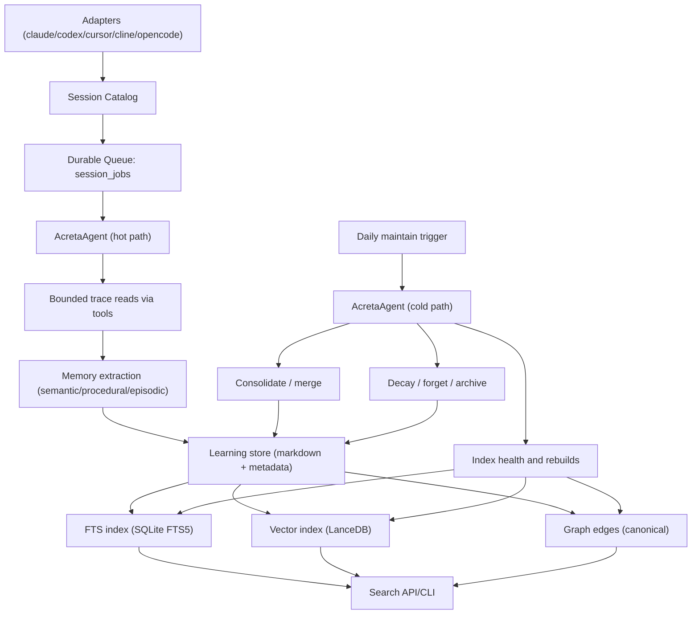
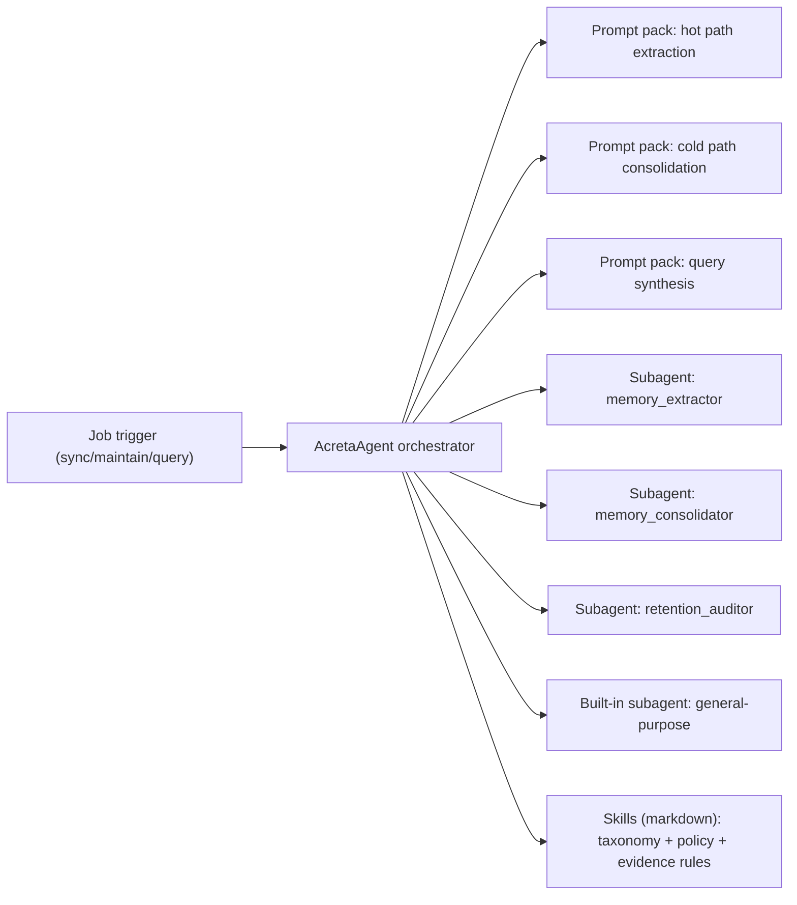

# Acreta Plan (Architecture + Memory Lifecycle)

Date: 2026-02-14  
Status: Draft for implementation  
Owner: Isaac

## Summary

This plan updates Acreta with one clean goal:

1. Ingest coding-agent sessions.
2. Extract semantic, procedural, and episodic memory.
3. Store and index memory for FTS + vector + graph search.
4. Run daily cold-path consolidation and forgetting.

Design rule: one central runtime agent (`AcretaAgent`) orchestrates all memory work.  
Design rule: no full-session dumps into prompt context; use tool-first bounded reads.

## How to use

Use this file as the execution checklist.

- Keep every task as `[ ]` before implementation.
- When a task is done and verified, switch it to `[x]`.
- Work phase by phase. Do not start later phases before core invariants pass.
- If scope changes, update this file first, then code.

## What we learned from Letta posts

Sources checked:
- [Letta Filesystem](https://www.letta.com/blog/letta-filesystem)
- [Sonnet 4.5 + Memory Omni Tool in Letta](https://www.letta.com/blog/introducing-sonnet-4-5-and-the-memory-omni-tool-in-letta)
- [Context Repositories](https://www.letta.com/blog/context-repositories)

Useful patterns to adopt in Acreta:

- Filesystem tools should be first-class.
  - Memory extraction works best when agent uses read/edit tools on files, not giant inline context.
- Persistent memory should be explicit and structured.
  - Keep durable memory records with strong metadata and provenance.
- Subagents should run constrained jobs.
  - Use the central orchestrator to delegate narrow tasks (extract, merge, retention review).
- Context should be loaded on demand.
  - Keep default prompt context small.
  - Pull repo/context documents only when needed, via indexed retrieval.
- Git/worktree-style isolation is useful for heavy reasoning tasks.
  - Use isolated analysis runs for cold-path consolidation and policy checks.

## Architecture update (with memory signal policy)

Main decision: learn from both conversation and tool/runtime signals, with source tags.

- Conversation signals:
  - user intent, requirements, decisions, preferences, confirmed outcomes.
- Tool/runtime signals:
  - commands run, tool errors, stack traces, edits, file diffs, test results.

Keep both, but rank reliability by evidence quality and outcome.

### Runtime architecture

### Agent architecture

## Prompt packs

### Hot path prompts

- `extract_memory_prompt`
  - Input: run_id, adapter type, archive paths, bounded read policy.
  - Output: strict JSON memory candidates + evidence offsets.
- `extract_episodic_prompt`
  - Input: selected key turns/events only.
  - Output: short episodic summary (not full transcript summary).

### Cold path prompts

- `consolidate_memory_prompt`
  - Merge duplicates and overlapping learnings.
  - Preserve provenance links.
- `retention_review_prompt`
  - Apply decay/forget/archive policy with explicit rationale.
- `maintenance_report_prompt`
  - Produce deterministic report for audit.

### Query prompt

- `answer_from_memory_prompt`
  - Read-only.
  - Returns answer plus memory citations/evidence.

## Data model changes

Add explicit source and reliability fields to each learning:

- `signal_sources`: list of `user_agent`, `tool_runtime`, `system`.
- `evidence_items[]`:
  - `source_type` (`message`, `tool_call`, `tool_result`, `file_diff`, `test_output`, `error_log`)
  - `source_ref` (run_id + file + line span or event id)
  - `outcome` (`success`, `failure`, `mixed`, `unknown`)
- `durability_score` (0-1)
- `volatility` (`low`, `medium`, `high`)
- `last_validated_at`

## Context repository pattern for Acreta

Add a separate context corpus, loaded only when needed:

- Repo docs/specs/runbooks are indexed as `context_docs`.
- They are not auto-injected into every extraction/query prompt.
- Query planner decides when to fetch them.
- Keep personal/team memory index separate from context-doc index.

## Implementation checklist

### Phase 0 - Scope lock and baseline

- [x] Freeze target scope to: ingest -> extract -> store/index -> search -> maintain.
- [x] Confirm non-core surfaces to remove from runtime (readiness, eval runtime, extra analysis branches).
- [x] Record baseline commands and expected behavior (`sync`, `maintain`, `chat`, `memory search`, dashboard smoke).
- [x] Record baseline tests and run unit suite.

Baseline notes:
- `uv run python -m acreta --help` confirms minimal runtime command surface (`connect/sync/maintain/daemon/dashboard/memory/chat/status`).
- `uv run scripts/run_tests.sh unit` passed on baseline: 475 passed, 1 skipped, 8 deselected.

### Phase 1 - Canonical architecture and folders

- [x] Finalize target folder structure for minimal core runtime.
- [x] Move/rename modules toward canonical domains (`adapters`, `sessions`, `extract`, `memory`, `search`, `maintain`, `agent`, `app`).
- [x] Keep compatibility shims only where needed for CLI stability.
- [x] Remove dead folders that do not map to target architecture.

### Phase 2 - Queue-first hot path

- [x] Ensure every newly discovered session is enqueued in `session_jobs`.
- [x] Implement robust job state machine (`pending`, `running`, `done`, `failed`, `dead_letter`).
- [x] Add retry/backoff policy and max-attempt handling.
- [x] Enforce idempotency by unique job key (`adapter`, `run_id`, `job_type`).
- [x] Add worker claim/heartbeat timeout to recover stuck jobs.

### Phase 3 - Memory extraction pipeline

- [x] Implement bounded evidence reader (windowed reads, no full transcript injection).
- [x] Implement hot-path prompt pack and strict JSON schema parser.
- [x] Extract semantic/procedural/episodic records in one pipeline.
- [x] Store raw archives and normalized learning docs.
- [x] Add memory quality gates (minimum evidence count, confidence floor, dedupe before write).

### Phase 4 - Dual-signal ingestion with tags

- [x] Ingest user-agent messages as one signal class.
- [x] Ingest tool/runtime artifacts as second signal class.
- [x] Persist `signal_sources` and per-evidence `source_type`.
- [x] Persist outcome metadata (`success`/`failure`/`mixed`/`unknown`).
- [x] Rank retrieval with source-aware scoring and reliability weighting.

### Phase 5 - Indexing and search

- [x] Keep write operations only in sync/maintain lanes.
- [x] Keep query lane read-only (no lazy sync side effects).
- [x] Validate FTS + vector + graph index consistency after writes.
- [x] Implement unified search fusion (keyword + semantic + graph boosts).
- [x] Return evidence-backed results with source tags.

### Phase 6 - Graph unification

- [x] Keep one canonical graph edge store for runtime and dashboard.
- [x] Remove or refactor duplicate graph computation paths.
- [x] Add graph edge provenance to learning ids and evidence refs.
- [x] Add tests for graph parity between retrieval and dashboard views.

### Phase 7 - Cold-path maintenance

- [x] Implement daily consolidation runner (merge/replace/resolve conflicts).
- [x] Implement forgetting/decay policy with thresholds and audit log.
- [x] Implement periodic index health checks and targeted rebuilds.
- [x] Produce deterministic maintenance reports.
- [x] Keep cold path isolated from user query request path.

### Phase 8 - Central agent, subagents, skills

- [x] Keep one orchestrator runtime agent: `AcretaAgent`.
- [x] Define programmatic subagents in Python (`memory_extractor`, `memory_consolidator`, `retention_auditor`).
- [x] Use built-in general-purpose subagent only for bounded support tasks.
- [x] Implement skill files for taxonomy/policy/evidence rules.
- [x] Bind prompt packs to correct lane (hot vs cold vs query).

### Phase 9 - Context repositories

- [x] Create `context_docs` index for repo-level reference context.
- [x] Add retrieval policy to fetch context docs only when needed.
- [x] Keep context docs outside personal/team memory ranking unless query requires it.
- [x] Add citation metadata so answers show whether source is memory or context-doc.

### Phase 10 - Dashboard and CLI alignment

- [x] Keep dashboard as thin read-only view over canonical stores.
- [x] Confirm CLI command to run dashboard still works after refactor.
- [x] Expose queue health, extraction status, and maintenance status in dashboard.
- [x] Remove dashboard-owned write logic from extraction/indexing paths.

### Phase 11 - Cleanup and dead code removal

- [x] Remove dead code, dead imports, and unreachable handlers across `acreta/`.
- [x] Run `ruff check . --select F401,F841` and fix all findings.
- [x] Run `vulture acreta tests vulture_whitelist.py` and remove real dead code.
- [x] Remove obsolete docs/commands that refer to removed runtime surfaces.

### Phase 12 - Verification and rollout

- [x] Add unit tests for queue lifecycle, no-drop guarantees, dual-signal tagging, and read-only query behavior.
- [x] Add tests for extraction quality gates and schema validation.
- [x] Add tests for cold-path merge/forget outcomes.
- [x] Run full unit test suite.
- [x] Prepare migration note and rollback steps for storage/index changes.

### Phase 13 - Post-migration cleanup pass (2026-02-14)

- [x] Simplify `acreta/config/settings.py` to 004-only config fields (remove readiness/eval/enrichment/context legacy fields).
- [x] Rewrite `acreta/sessions/catalog.py` to minimal catalog + queue + service-run APIs used by 004 runtime.
- [x] Remove legacy extract compatibility exports (`run_refine_*`) from public module surface.
- [x] Update runtime docs/skills to 004 command surface and archive outdated command docs.
- [x] Re-run CLI smoke checks after cleanup (`--help`, `connect list`, `sync --dry-run`, `maintain --dry-run`, `memory list`, `status`).

## Acceptance criteria

- [x] New sessions are never silently dropped from extraction.
- [x] Query path is read-only and deterministic.
- [x] Memory records include source tags and evidence provenance.
- [x] Both interaction and tool/runtime learnings are supported and distinguishable.
- [x] One canonical graph powers both retrieval and dashboard.
- [x] Cold path handles consolidation/forgetting without blocking hot path.
- [x] Runtime surface is minimal and aligned to core product.

## Audit round 2 (2026-02-14)

- [x] Re-verified command surface against 004 scope (`connect/sync/maintain/daemon/dashboard/memory/chat/status`).
- [x] Re-verified queue lifecycle with heartbeat support (`pending/running/done/failed/dead_letter` + stale recovery).
- [x] Added explicit Python subagent specs (`memory_extractor`, `memory_consolidator`, `retention_auditor`) and lane mapping.
- [x] Wired lane subagents into extraction/report agent runs.
- [x] Re-verified query lane remains read-only while adding conditional `context_docs` retrieval policy.
- [x] Re-ran static checks (`ruff`, `vulture`) and unit suite after alignment changes.

Verification commands used:
- `uv run ruff check acreta tests`
- `uv run vulture acreta tests --min-confidence 80`
- `scripts/run_tests.sh unit`
- `uv run python -m acreta --help`
- `uv run python -m acreta connect list`
- `uv run python -m acreta sync --dry-run --window 1d --json`
- `uv run python -m acreta maintain --dry-run --window 1d --json`
- `uv run python -m acreta status --json`

## Audit round 3 (2026-02-14)

- [x] Re-checked that no 004 checklist items remain unchecked.
- [x] Re-validated top-level `acreta/` domain structure matches canonical 004 modules.
- [x] Removed remaining backend readiness compatibility residue from dashboard API/routes.
- [x] Re-ran static + unit checks after cleanup (`ruff`, full unit suite).
- [x] Re-ran CLI smoke for connect/sync/maintain/status with dry-run checks.

Verification commands used:
- `rg -n "^- \\[ \\]" specs/004-minimal-core-rebuild/plan.md`
- `find acreta -maxdepth 1 -type d | sort`
- `rg -n "readiness|eval|admin" acreta/app acreta/runtime acreta/extract acreta/memory acreta/sessions acreta/adapters acreta/config`
- `uv run ruff check acreta tests`
- `scripts/run_tests.sh unit`
- `uv run python -m acreta connect list`
- `uv run python -m acreta sync --dry-run --window 1d --json`
- `uv run python -m acreta maintain --dry-run --window 1d --json`
- `uv run python -m acreta status --json`

## Out of scope

- Multi-agent autonomous planning as a product feature.
- Broad platform adapters beyond current supported agents.
- New hosted SaaS capabilities not needed for local core runtime.
