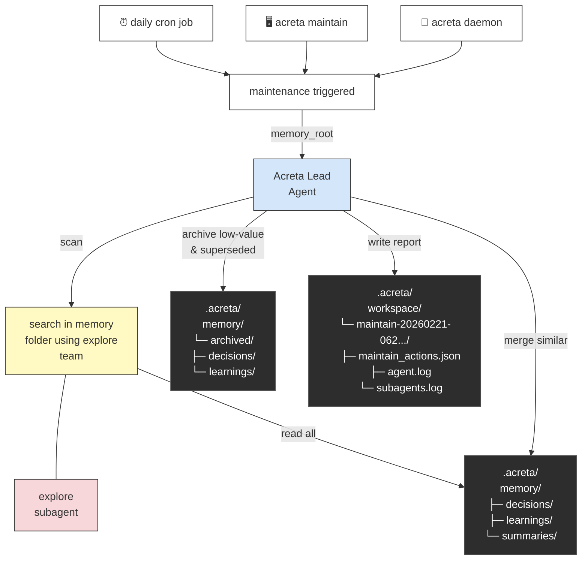

# Maintain Path

```mermaid
flowchart TD
    cron["⏰ daily cron job"]
    manual["🖥️ acreta maintain"]
    daemon["🔄 acreta daemon"]

    cron --> trigger["maintenance triggered"]
    manual --> trigger
    daemon --> trigger

    trigger -->|"memory_root"| agent["Acreta Lead\nAgent"]

    agent -->|"scan"| explore["search in memory\nfolder using explore\nteam"]

    explore_sub["explore\nsubagent"]
    explore --- explore_sub

    explore -->|"read all"| memory[".acreta/\nmemory/\n├─ decisions/\n├─ learnings/\n└─ summaries/"]

    agent -->|"merge similar"| memory
    agent -->|"archive low-value\n& superseded"| archived[".acreta/\nmemory/\n└─ archived/\n    ├─ decisions/\n    └─ learnings/"]

    agent -->|"write report"| workspace[".acreta/\nworkspace/\n└─ maintain-20260221-062.../\n    ├─ maintain_actions.json\n    ├─ agent.log\n    └─ subagents.log"]

    style agent fill:#d4e6f9,stroke:#333
    style explore fill:#fff9c4,stroke:#333
    style explore_sub fill:#f8d7da,stroke:#333
    style memory fill:#2d2d2d,color:#fff,stroke:#555
    style archived fill:#2d2d2d,color:#fff,stroke:#555
    style workspace fill:#2d2d2d,color:#fff,stroke:#555
    style trigger fill:#fff,stroke:#333
    style cron fill:#fff,stroke:#333
    style manual fill:#fff,stroke:#333
    style daemon fill:#fff,stroke:#333
```
